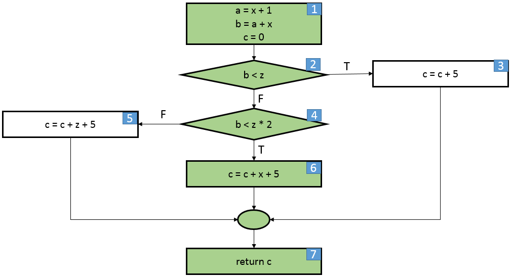
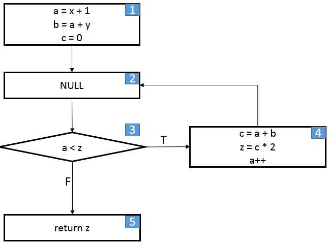

# הנדסת איכות תוכנה - סדנה - שלב ג' 

### נושא: CFG  
בשלב זה יפותח רכיב מערכת שהקלט שלו מורכב מ:
* קטע קוד הכולל פונציה
* קלט לפונקציה בפורמט הבא:
    * agr-1, arg-2, ..., arg-n
    * מחרוזת "תעטף" בגרש או גרשיים. דוגמה: 'hello world'
    * ערך מספרי או בוליאני. דוגמה: 1, true, 3.14
    * מערך יופיע "עטוף" בסוגריים מרובעים. דוגמה: [1, 2, 3], [hello', 5, true']

והפלט שלו מורכב מהחלקים הבאים:
* הפונקציה, ביצוגה הויזואלי כ CFG הכוללת קודקודים, קשתות ושאר הסימנים כפי שנלמד
* יש לצבוע את הקודקודים המייצגים את המסלול שנוצר ע"י הקלט בצבע ירוק

* פונקצית הקלט תוכל לכלול:
    * הגדרה והשמה של משתנים
    * תנאים מסוג if - else-if - else
    * לולאות while
    * return יחיד
    

* דוגמה:

```javascript 1.7
function foo(x, y, z){
    let a = x + 1;
    let b = a + y;
    let c = 0;
    
    if (b < z) {
        c = c + 5;
    } else if (b < z * 2) {
        c = c + x + 5;
    } else {
        c = c + z + 5;
    }
    
    return c;
}
foo(1, 2, 3)
```



```javascript 1.7
function foo(x, y, z){
   let a = x + 1;
   let b = a + y;
   let c = 0;
   
   while (a < z) {
       c = a + b;
       z = c * 2;
       a++;
   }
   
   return z;
}
foo(1, 2, 3)
```




How to run test coverage and see the report:
1. npm run coverage
2. nyc report
3. npm run lint